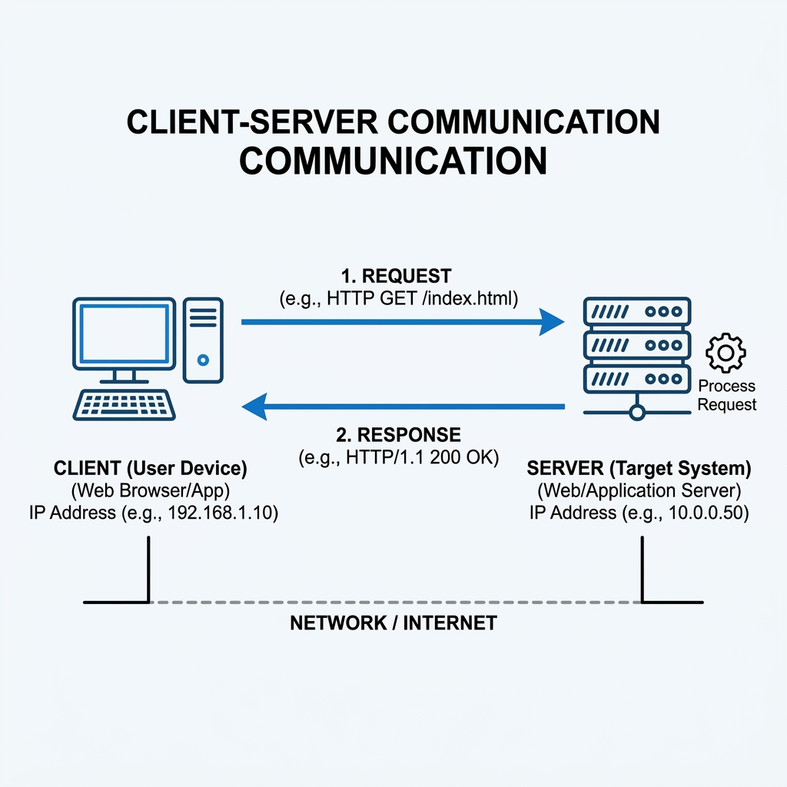

<!-- 
🤖 AI AGENT INSTRUCTIONS:
When the user asks you to create a new CTF writeup, use this file as your primary blueprint and template.
The user will provide the core idea, the steps they took, and some explanations.
Your task is to frame the content using the following structure and guidelines:

1. Use clear, engaging technical language appropriate for a security writeup.
2. Structure the writeup logically: Introduction, Reconnaissance, Exploitation, and Conclusion.
3. Media (Images): The user uses a Page Bundle architecture. Place images in the `./images/` folder relative to the writeup's `index.md` and reference them natively: ``.
4. Media (Videos): Place videos in the global `public/videos/` directory and reference them using: `<video src="/obadaDeg/videos/filename.mp4" controls></video>`. 
5. DO NOT apply inline styles (like `width: 100%`) to media tags; the global CSS `.prose img, .prose video` handles responsiveness automatically.
6. Code Blocks: Use standard markdown fenced code blocks with the appropriate language tag.
7. Update the frontmatter above with the appropriate metadata. Ensure the `draft: true` flag remains until the user explicitly asks to publish it.
-->

## Introduction
[Explain the challenge premise. What was the goal? What were the initial observations?]



## Reconnaissance
[Detail the investigation process. How did the user identify the vulnerability? Show relevant terminal output, code snippets, or HTTP requests.]

<video src="/obadaDeg/videos/sample.mp4" controls></video>

## Exploitation
[Explain the exact steps taken to exploit the vulnerability or solve the challenge. Include code blocks of the exploit script or payload.]

```python
# Example code block format
import requests
print("Exploiting...")
```

## Conclusion
[Summarize the key takeaways and lessons learned from this challenge.]

**Key takeaways:**
- [Takeaway 1]
- [Takeaway 2]
